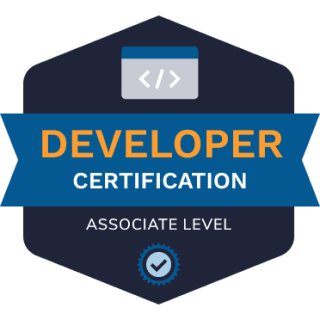

# Apache Cassandra 3 Developer Associate Certification

Apache Cassandra™ 3.x Developer Associate Certification is the ideal foundational certification exam for developers looking to test their Apache Cassandra™ skills.

## Exam Facts

- [Certification homepage](https://www.datastax.com/dev/certifications)
- [Exam rules](https://www.datastax.com/dev/certification-rules)
- 60 questions
- Duration: 90 minutes
- Passing score: 70%
- Regular price: $145
- Proctored by [Mettl](https://mettl.com/)
- Exam dashboard: https://certification.mettl.com/datastax/applicant/login

## Learning Path

1) Watch [Academy DS201 Foundations of Apache Cassandra](https://www.youtube.com/playlist?list=PL2g2h-wyI4Spf5rzSmesewHpXYVnyQ2TS)
2) Watch [Academy DS220 Data Modeling with Apache Cassandra](https://www.youtube.com/playlist?list=PL2g2h-wyI4SqIigskyJNAeL2vSTJZU_Qp)

Additional material:
- Workshop: Cassandra Certification Exam Preparation: [NAM](https://www.youtube.com/watch?v=1NSUXcWrkZM) or [EMEA/APAC](https://www.youtube.com/watch?v=9lNhGwNucZ0)
- [Introduction To Apache Cassandra](https://www.youtube.com/watch?v=B_HTdrTgGNs)
